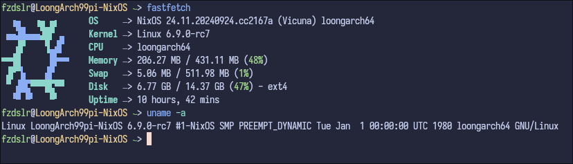

# NixOS on LoongArch 99 Pi



This repository aims to port NixOS to the LoongArch architecture for an embedded development board (99 Pi).

Due to the incomplete upstream support for the LoongArch architecture, some rather hackish methods have been employed to facilitate the build process.

### How to build?

Build a SD image:

```bash
nix build .#sdImage -L --show-trace --impure
```

Build and update to an existing system:

```bash
nixos-rebuild build --flake .#loong99pi --show-trace
nixos-rebuild switch --flake .#loong99pi --target-host root@xxx.xxx.xxx.xxx --verbose --show-trace
```

### Thanks and References

- [ryan4yin's NixOS on licheepi4a](https://github.com/ryan4yin/nixos-licheepi4a/): this repository is mainly based on his work
- [NixOS search](https://search.nixos.org)
- [xieby1.github.io](https://xieby1.github.io/nix_config/docs/howto/cross.html): explained how NixOS's cross cross-compilation works

